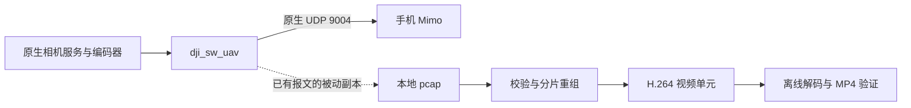

Mimo 原生预览解析与共存验证，2026-09-19。相机运行 Action Control 0.1.10；本轮新增离线工具和研究文档，未更新相机程序。

**已从 Mimo 正在使用的原生 UDP 流中重组出完整 H.264 预览，并在电脑上完成解码和无重新编码的 MP4 封装。已在 Mimo 连接期间验证 Action Control 的原生录像启停。** 这些结果不等于已经实现脱离 Mimo 的网页实时预览，也不等于第二个原生预览订阅者已经通过验证。

本轮条件与验收结果：

| 项目 | 结果 |
| --- | --- |
| 用户确认 | 开始时用户确认 Mimo 在实时预览页，画面和按钮正常 |
| 网络 | 原生 AP `192.168.2.1`，手机 `192.168.2.62:59604`；Action Control 仍为 `control=native`、`owner=native`，独立采集停止 |
| 预览编码 | 本次会话为 H.264 High / Level 3.2、1280×720；按采样时刻和原生时间戳间隔观察约 25 fps |
| 12 秒基准采样 | 5,826 个 SW 报文通过头校验；1,240 条 DUML 消息通过 CRC8/CRC16；重组 298 个完整视频访问单元，采样结尾剩 1 个不完整帧 |
| 较长共存观察 | 约 90 秒采样内有 44,824 个有效 SW 报文、9,365 条有效 DUML 消息、2,249 个完整访问单元；35 次本地原生查询均为空闲，视频持续传输；结尾 1 个不完整帧 |
| 离线解码 | 从首个完整 SPS/PPS/IDR 开始导出 279 帧；移除 SEI/AUD 后，ffprobe 与 `ffmpeg -xerror` 解码均成功且无错误输出 |
| 可播放验证文件 | `preview-reconstructed.mp4`，H.264 1280×720、25 fps、279 帧、11.16 秒、4,978,371 字节；视频复制封装，无重新编码、无音频 |
| 原生控制与 Mimo 共存 | 本地接口开始、停止均返回原生代码 0 和 `confirmed`，状态为 `3/0 → 1/0 → 3/0`；结束后未录像 |
| 原生保存 | 相机保存 `DJI_20260919010911_0325_D.MP4`（10,072,002 字节）及 LRF/WAV，文件保留；本轮未额外检查该录像文件的全部媒体内容 |
| 录像期间预览采样 | 6,185 个有效 SW 报文、1,431 条有效 DUML 消息、320 个完整视频访问单元；结尾 1 个不完整帧；发现切换间隔和时间戳重置，见下文 |
| 原生服务 | 相机、媒体、双屏、Mimo 通信和网络服务的 PID 及启动 ID 均保持不变；未重启原生服务 |

基准采样中的 4 次查询，加上较长采样中的 35 次查询，验证了该会话里本地读取客户端的反复创建、连接和释放与 Mimo 视频传输可共存。本地录像启停验证了服务与传输层的共存；录像切换后的 Mimo 屏幕、按钮和计时显示没有取得明确的人工验收结论。

用户对 00:55:21 的另一段录像是否来自 Mimo 回答“好像是”，因此仍将来源记为待确认。此前约 90 秒采样窗口没有观察到录像状态变化，不能用这段未对齐的录像去宣布已恢复 Mimo 的开始/停止线上指令。

当前打通的研究路径是：



没有建立第二条相机采集管线，没有向手机或相机发送猜测的网络命令。采样使用非混杂模式的 `tcpdump -i wlan0 -p`，只选择 UDP 9004，通过 USB 传到电脑；每段采样均有独立超时。原始报文和视频保存在被 Git 忽略的本地研究目录，不随代码或发布包分发。

已核对的封装范围：

| 层次 | 当前证据及解析行为 |
| --- | --- |
| 抓包输入 | 经典 pcap 2.4、Ethernet、IPv4/UDP；校验捕获长度、IP/UDP 长度，拒绝截断、IP 分片和不支持的输入格式 |
| SW 公共头 | 8 字节；前 16 位低 14 位为 UDP 负载长度，本次高两位为 2；第 7 字节为前 7 字节的 XOR；中间的 16 位标记用于区分观测到的流，尚未恢复其完整会话语义 |
| SW 类型 | 本次 `2` 承载视频分片，`3/5` 承载两个方向的控制消息，`1/4` 承载窗口应答并可附带控制消息；`0` 的建立连接报文未实现 |
| 视频分片 | 数据从 UDP 负载偏移 20 开始；偏移 16 的小端 32 位字段包含 8 位帧号、6 位数据分片数、FEC 标志及 6 位分片索引；FEC 和未核实标志拒绝处理 |
| 重组 | 限制为同一网络流和标记；处理帧号回绕、片内乱序、相同重传，拒绝冲突数据；最多保留 64 个帧号的窗口；不完整帧不作为完整视频输出 |
| 原生媒体头 | 本次为 `00 00 01 ff`、16 字节头、`0x90/0x11` 变体；校验 XOR、声明的视频长度，读取 32 位原生时间戳，然后解析 Annex-B |
| DUML | 在控制分片偏移 20，或本次应答报文附加区偏移 34 取得消息；校验版本、长度、CRC8 和 CRC16，再报告发送方、接收方、序号、命令组/ID及载荷摘要 |

DUML 校验采用观测中验证的 CRC8 初值 `0x77` / 反射多项式 `0x8c`，CRC16 初值 `0x3692` / 反射多项式 `0x8408`。本轮所有被解析的完整 DUML 消息均通过两项校验，结论来自结构化拆包，不再使用对任意 UDP 字节的裸起始码扫描。

静态证据来自已保存的 `libduml_frwk.so`：`SW_CheckSum`（`0xc67a0`）、`SW_Alg_Send_Get_Send_Pkt`（`0xcc6a0`）及 `wl_mm_header_insert`（`0xbd0d0`）。它们分别支持头 XOR、帧号/分片位域和媒体头布局。库副本仅用于离线分析，没有加载到相机上的新进程或纳入工具分发。

控制消息统计包括推送、应答和可能的重复发送，不能当作用户点击次数。解析器保留序号、方向和载荷摘要供后续对齐；它不将已看到的数字自动命名为“拍照”“录像”或“订阅”。控制分片跨包重组、认证及完整请求语义尚未实现。

**播放器适配还有两个已实测的问题。**

第一，当前预览每帧附带一种 SEI 单元。直接把原生字节交给 ffprobe 会出现 `non-existing SPS 32 referenced in buffering period`；只移除 SEI 后，文件末尾的 AUD 仍导致“缺少画面”提示。工具的可选视频导出只保留 SPS/PPS 和视频片，明确移除 NAL 类型 6、9。导出后的 279 帧通过严格解码。这样做会丢弃 SEI 中的元数据，因此这是用于验证的视频导出，不是对所有原生元数据的无损保留。

第二，录像切换改变预览时钟和输出节奏：

| 本地操作附近 | 观察到的视频变化 |
| --- | --- |
| 开始录像 | 相邻完整帧的捕获间隔约 0.364847 秒；原生时间戳 `825455 → 0`，新帧带 SPS/PPS/IDR |
| 录像接近停止时 | 一次原生时间戳增加 470，而捕获间隔约 0.041401 秒，不能简单把原生时间差照搬为播放间隔 |
| 停止录像 | 相邻完整帧的捕获间隔约 0.610748 秒；原生时间戳 `4249 → 0`，新帧带 SPS/PPS/IDR |

这些间隔不代表整个网络连接断开；控制流仍存在，原生服务 PID 不变，后续视频恢复输出。尚未取得“只在 Mimo 上开始/停止”的同步抓包对照，因此不能断言这些间隔一定是正常原生行为，也不能将传输层成功写成手机画面完全无感。

未来网页转发需要处理时钟重置、新参数集/关键帧和断流恢复；不能直接累计原生时间戳或把 UDP 内容拼进播放器。裸 H.264 的 ffprobe `r_frame_rate` 在本次数据中还出现不可信的 `1200000/1`，25 fps 的依据是实际采样时间、原生常态 39/40 tick 间隔及帧数。验证 MP4 使用本次观测的 25 fps 重建文件时间轴，未保留原生时间戳。

已实现的工具：[mimo_pcap.py](../tools/mimo_pcap.py)。它只读电脑上的 pcap，输出分析 JSON，可选导出视频；不会访问设备或发送报文。

```sh
python3 -B tools/mimo_pcap.py capture.pcap --report capture-report.json --h264 preview.h264
python3 -B tools/test_mimo_pcap.py
```

输出路径必须不存在，并且不能与输入相同。输入损坏时删除本次未完成的输出；分析中遇到未核实报文会保留报告并返回退出码 2，便于检查。采样结尾缺少最后几个分片会单独记为 `pending_frames_at_eof`，不会拼入视频。导出会在缺帧后等待下一个完整 SPS/PPS/IDR；迟到的旧帧不倒序写入。13 项离线测试覆盖截断、双 CRC、冲突、乱序、回绕、FEC 拒绝、缺帧恢复、时钟重置和输出文件保护。

本次 `adb shell -T` 在三份完整 pcap 后均附加了一个 `0a` 字节。已逐条验证记录边界，保留原始文件，另生成只去除此尾字节的 `.normalized.pcap`，并记录两者哈希。通用解析器仍拒绝任意尾部垃圾，不隐式截掉未知数据。

证据目录：`.build-tools/mimo-native-analysis/session-20260919/`。

| 文件 | 内容 |
| --- | --- |
| `preview-baseline.json`、`mimo-actions.json` | 采样时间、tcpdump 统计和期间的本地原生状态查询 |
| `preview-final.json`、`mimo-actions-final.json`、`local-recording-final.json` | 最终解析工具生成的完整统计、控制消息摘要和时钟事件 |
| `local-recording-with-mimo.json` | 真实本地录像启停结果、前后状态和采样统计 |
| `recording-preview-clock.json` | 录像切换附近原生时钟、相邻帧间隔及关键帧证据 |
| `preview-video-validation.json` | ffprobe 与严格解码的返回码和输出 |
| `preview-reconstructed.mp4` | 11.16 秒可播放验证短片 |
| `capture-normalization.json` | 原始 pcap 与规范化副本的记录数、尾字节和 SHA-256 |
| `final-device-state.json` | 收尾网络、原生服务、录像状态和观察进程检查 |

后续仍待完成：

| 工作 | 当前边界 |
| --- | --- |
| Mimo 实际录像、拍照、订阅命令 | 解析和校验工具已具备；需要操作发生时的同步抓包及明确的手机动作记录 |
| Mimo 页面订阅/退订与心跳 | 当前会话建立已经发生；单纯保持预览的采样不能恢复完整生命周期 |
| 第二个原生预览消费者 | 现有预览被动重组可行，但没有创建或验证第二个订阅者 |
| 网页实时预览 | 尚未接入；需要确定数据获取生命周期、时间轴恢复及浏览器封装，避免占用相机采集权 |
| 配对、认证和蓝牙引导 | 当前连接不能补回此前握手，继续 pending |
| 手机端最终体验、网页访问 | 录像切换后的明确人工确认及手机浏览器访问仍待验收 |

当前最可靠的复用方式仍是：状态和录像通过已验证的本地客户端交给原生服务；预览复用原生已编码视频，并继续核实消费者生命周期。完整进度见 [原生相机复用文档](NATIVE_CAMERA_REUSE.md)。
